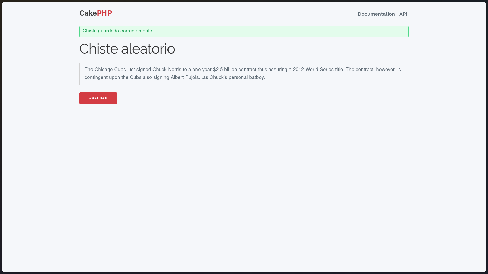
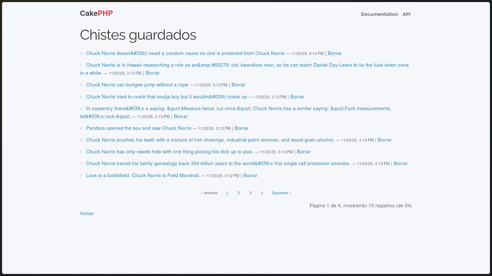
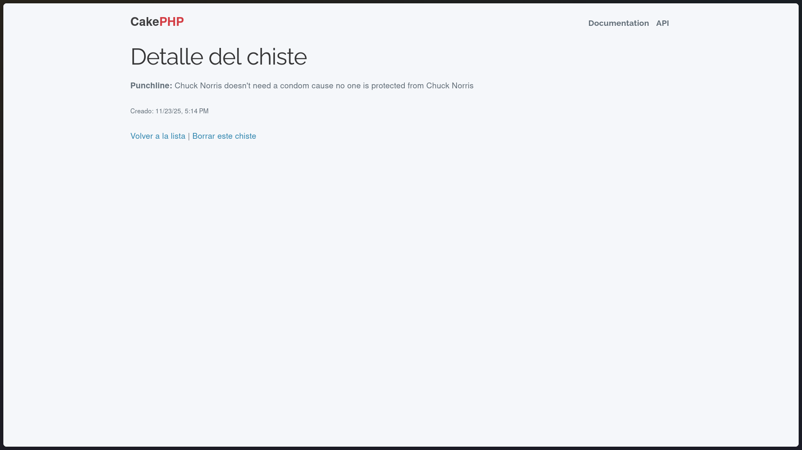

**Resumen**

- **Proyecto:** Chuck Jokes (CakePHP 5 + SQLite).
- **Objetivo:** Documentar qué solicitó la tarea, qué se ha hecho y qué falta, con instrucciones claras para ejecutar y verificar la aplicación dockerizada.

**Requisitos**

- `PHP` (en contenedor): actualmente el contenedor PHP usa `php:8.3`.
- `Composer` 2.x disponible en el contenedor PHP.  
- `Docker` + `docker compose` para levantar los servicios.

**Qué se pedía la tarea (checklist) y estado**

- **Crear proyecto CakePHP 5**: `Hecho` — el proyecto existe en el repositorio.
- **Configurar SQLite en `config/app_local.php`**: `Hecho` — la configuración usa `driver` Sqlite y la ruta de base de datos está en `tmp/database.sqlite` / o vía `DATABASE_PATH`.
- **Crear migración y aplicar (tabla `jokes`)**: `Hecho` — migraciones ejecutadas (salida: "All Done.").
- **Generar modelo/entidad `Jokes`**: `Hecho` — existen `src/Model/Table/JokesTable.php` y `src/Model/Entity/Joke.php` (según estructura del proyecto).
- **Crear controlador `JokesController::random` y vistas**: `Hecho` — existe la acción y plantillas en `templates/Jokes/` (según árbol del repo).
- **Añadir ruta `/jokes/random`**: `Hecho` — ruta añadida en `config/routes.php` (según guía y estructura).
- **Dockerizar (PHP-FPM + Nginx + docker-compose)**: `Hecho` — `docker-compose` y Dockerfile creados y contenedores levantados; sitio responde (o está en proceso de verificación).
- **Asegurar permisos en `tmp` y `logs`**: `Hecho` — `tmp/database.sqlite` y demás ficheros tienen permisos de escritura (se aplicó `chmod 0777` durante configuración).
- **Instalar dependencias de desarrollo (PHPUnit, etc.) y ejecutar tests**: `Hecho` — el contenedor PHP está usando `php:8.3` y las dependencias de desarrollo (incluyendo `phpunit`) están presentes en `vendor/`.

**Resumen del estado actual (qué funciona ya)**

- Contenedores: PHP y Nginx construidos y arrancados por `docker compose`.
- `vendor/` y `bin/cake` están presentes en el contenedor: runtime listo.
- Las migraciones se ejecutaron correctamente y `tmp/database.sqlite` existe.
- El sitio puede comprobarse vía `curl` o en el navegador (puerto por defecto del `docker-compose`: `8080`).

**Pendientes / Notas menores**

- El proyecto ya tiene PHP 8.3 en el contenedor y las dependencias de desarrollo instaladas; por tanto no quedan tareas críticas sin resolver.
- Se pueden ejecutar los tests (si hay tests) con `composer test` o `vendor/bin/phpunit` dentro del contenedor para validar comportamiento.

**Comandos útiles para verificar (y salida esperada)**

- Ver contenedores:
  - Comando: `docker compose ps`
  - Éxito esperado: columna `State` con `Up` para `php` y `nginx`, y mapeo de puertos (ej. `0.0.0.0:8080->80/tcp`).

- Comprobar que la app responde HTTP:
  - Comando: `curl -I http://localhost:8080`
  - Éxito esperado: `HTTP/1.1 200 OK` o `302 Found`.

- Entrar en el contenedor PHP y comprobar versión de PHP:
  - Comando: `docker compose exec php bash -lc "php -v"`
  - Resultado esperado: si no hiciste el cambio, `PHP 8.2.x`; si actualizaste, `PHP 8.3.x`.

- Instalar dependencias sin dev (rápido):
  - `docker compose exec php bash -lc "composer install --no-dev --no-interaction --prefer-dist"`
  - Éxito esperado: `Generating autoload files` sin errores.

-- Instalar dependencias con dev (ya configurado en este repo):
  - El `Dockerfile` del proyecto usa `FROM php:8.3-fpm` y el contenedor tiene PHP 8.3; las dependencias dev están en `vendor/`.
  - Para asegurar que todo está al día: `docker compose exec php bash -lc "composer install --no-interaction --prefer-dist"`.

- Ejecutar migraciones (si hace falta repetir):
  - `docker compose exec php bash -lc "bin/cake migrations migrate"`
  - Éxito esperado: `All Done. Took X.XXXXs` o `No migrations to run`.

**Capturas de pantalla**

**Notas finales / Entrega**

He creado este `README.md` en español que recoge lo que se pidió y el estado actual del proyecto.  

— Fin del README (versión automática generada teniendo en cuenta los archivos del repositorio y las salidas de tus comandos).
